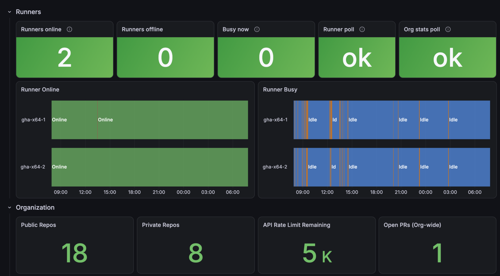

# github-actions-runner-exporter

[More Drumandbytes projects](https://drumandbytes.com/projects/?ref=github-actions-runner-exporter-readme)

A small Go exporter that polls the GitHub API for an organization's
self-hosted Actions runners, plus repo/CI health, PR counts and
Dependabot alerts, and exposes it all as Prometheus metrics.

## Why

GitHub doesn't publish any of this as metrics itself, and there's no
single well-maintained community exporter that covers it. Runner
up/busy state is real-time by nature; everything else (CI status, PR
counts, Dependabot alerts, rate limit) is polled on a much slower cache
TTL, deliberately - see [Two cache tiers](#two-cache-tiers) below.

CI status is tracked **per active workflow**, not per repo: checking
only the single most recent run across a repo's whole Actions history
would let a failing workflow hide behind a later, unrelated, successful
one (e.g. a broken `Validate` masked by a subsequent green `Build`).

Job queue and run times are recorded as **history**, with Prometheus as
the store - see [Run history](#run-history).

## Two cache tiers

| | Runner status | Org/repo stats |
| --- | --- | --- |
| Poll interval | `RUNNER_CACHE_TTL` (default 15s) | `ORG_CACHE_TTL` (default 5m) |
| Why | Genuinely real-time - a runner picking up a job matters within seconds | CI/PR/Dependabot signals don't change that fast, and cost 4 calls per repo per refresh, plus 1 per newly finished run - polling that every 15s across a few dozen repos would burn through GitHub's 5,000/hour rate limit for no benefit |

Both are polled on a timer in the background, not when Prometheus scrapes,
so a scrape never waits on GitHub and always reads data at most one
interval old. A runner picking up a job shows within the interval plus one
scrape.

## Metrics

| Metric | Labels | Meaning |
| --- | --- | --- |
| `github_runners_up` | | 1 if the last runner-status poll succeeded, 0 if a stale cache is being served or the first poll is still running |
| `github_runner_up` | `runner`, `os` | 1 if the runner is registered and online, 0 if offline |
| `github_runner_busy` | `runner`, `os` | 1 if the runner is currently executing a job, 0 if idle |
| `github_org_up` | | 1 if the last org/repo stats poll succeeded, 0 if a stale cache is being served or the first poll is still running (about a minute after startup at ~25 repos) |
| `github_org_repos_total` | `visibility` | Number of non-archived repos, by `public`/`private` |
| `github_rate_limit_remaining` | | Remaining core API budget in the scarcest active window: the one that runs out first |
| `github_rate_limit_limit` | | Total core API budget of that window |
| `github_rate_limit_window_remaining` | `reset` | Remaining budget per active core window, labelled with its reset time. GitHub counts per region, so one token can have several windows at once, and which one a call counts against depends on the endpoint. A window's series disappears once it resets |
| `github_repo_open_prs` | `repo` | Number of open pull requests |
| `github_repo_ci_last_run_conclusion` | `repo`, `workflow`, `url`, `conclusion` | Always 1 - an "info" metric. `conclusion` is GitHub's own string verbatim (`success`, `failure`, `cancelled`, `skipped`, `neutral`, `timed_out`, `action_required`, `stale`), not collapsed to pass/fail here - what counts as "actually broken" is a dashboard-level call. `url` links to the run on github.com. Absent if the workflow has never run |
| `github_repo_ci_last_run_timestamp_seconds` | `repo`, `workflow` | Unix timestamp of that workflow's latest completed run |
| `github_repo_ci_last_run_duration_seconds` | `repo`, `workflow` | Duration of that workflow's latest completed run, created → last update, so it includes queue time (the `github_job_*` histograms split the two) |
| `github_job_queue_seconds` | `repo`, `workflow`, `job_name`, `runner`, `runner_label`, `conclusion` | Histogram: time each finished job waited for a runner (`created_at` → `started_at`) |
| `github_job_run_seconds` | same as above | Histogram: time each finished job ran on its runner (`started_at` → `completed_at`) |
| `github_workflow_runs_total` | `repo`, `workflow`, `conclusion` | Counter: completed workflow runs, once per run attempt |
| `github_repo_dependabot_alerts_open` | `repo`, `severity` | Open Dependabot alerts by severity. Absent for a severity with zero open alerts |

## Run history

Each org refresh lists every repo's runs created since a per-repo
watermark (`GET /repos/{org}/{repo}/actions/runs?created=>=…`, paginated),
then fetches `…/runs/{id}/jobs` once per newly completed run and records
each job into the histograms above. The exporter keeps no history itself;
Prometheus does.

- **Watermark:** the oldest run still in progress, else the newest run
  seen. An in-progress run holds the watermark back so it's counted when
  it finishes, but at most 24h (a run stuck waiting for approval longer
  than that is never counted).
- **Dedupe:** finished runs (per attempt) and job IDs are remembered for
  48h, so overlapping polls and re-runs never double-count. A re-run
  counts as another run; jobs it carries over unchanged aren't recorded twice.
- **Restart:** starts from "now" - nothing that finished before startup is
  replayed. On startup one `LatestRunForWorkflow` call per active workflow
  fills the `github_repo_ci_last_run_*` metrics.
- Skipped jobs and jobs cancelled before a runner picked them up aren't
  recorded. The job's label is `job_name`, since Prometheus reserves `job`
  for the scrape job. `workflow` is the workflow's own name, never a run's
  title (Dependabot titles every run differently). GitHub-hosted runners show as `runner="github-hosted"` (their
  names are unique per job). `runner_label` is the job's `runs-on` labels
  minus `self-hosted`, e.g. `oracle-x64` / `oracle-arm64`: one per pool.
- Buckets: 5s, 10s, 30s, 1m, 2m, 3m, 5m, 10m, 15m, 20m, 30m, 60m.
- Cardinality grows with repo × workflow × job × runner × conclusion
  combinations that actually ran, × 14 series per histogram.

Example PromQL:

```promql
# average job run time per job over the last day
sum by (repo, workflow, job_name) (rate(github_job_run_seconds_sum[1d]))
  / sum by (repo, workflow, job_name) (rate(github_job_run_seconds_count[1d]))

# p95 job run time per job
histogram_quantile(0.95, sum by (le, repo, workflow, job_name) (rate(github_job_run_seconds_bucket[1d])))

# p95 queue time per runner pool
histogram_quantile(0.95, sum by (le, runner_label) (rate(github_job_queue_seconds_bucket[1d])))

# runs per day by conclusion
sum by (conclusion) (increase(github_workflow_runs_total[1d]))
```

## Rate limit

The budget comes from the `X-RateLimit-*` headers of the exporter's own API
responses, which GitHub documents as authoritative. `GET /rate_limit` isn't
used: it can disagree with the headers, and for our tokens it reported
`used: 0` throughout. Because GitHub serves requests from several regions, a
token can be counted in two `core` windows at once, with different reset
times and counts. On drumandbytes, runners, workflows and Dependabot alerts
landed in one window and everything else in another. The exporter tracks every
window it sees and alerts on the lowest.

## Configuration

| Env var | Default | Required |
| --- | --- | --- |
| `GITHUB_ORG` | | yes |
| `GITHUB_TOKEN` | | yes — see [Token permissions](#token-permissions) |
| `LISTEN_ADDR` | `:9222` | |
| `GITHUB_REQUEST_TIMEOUT` | `10s` | |
| `RUNNER_CACHE_TTL` | `15s` | |
| `RUNNER_CACHE_MAX_STALE` | `5m` | |
| `ORG_CACHE_TTL` | `5m` | |
| `ORG_CACHE_MAX_STALE` | `30m` | |

## Token permissions

A fine-grained PAT needs:
- **Repository access: All repositories** — scoping it to a curated list means every repo-level metric (PRs, CI, Dependabot) silently only covers the repos you picked.
- Repository permissions: **Metadata** (read, auto-included), **Pull requests** (read), **Actions** (read), **Dependabot alerts** (read).
- Organization permissions: whatever GitHub's console offers for self-hosted runners (its REST API docs only document `admin:org` for the classic-PAT path to that endpoint — narrower fine-grained scoping isn't guaranteed available for every org plan).

## Build / test / run

```bash
go build ./...
go vet ./...
go test ./...
docker build -t github-actions-runner-exporter .
```

CI (`.github/workflows/validate.yml`) gates on the `drumandbytes/reusable-actions`
`go-ci.yml` lint job and a Docker smoke test (`/healthz` against fake credentials —
never a real GitHub org). The Trivy image scan runs separately (`security.yml`,
on PRs and weekly on main). `build.yml` pushes multi-arch
images to GHCR with SLSA provenance attestation on push to `main`/tags.

## Grafana dashboard



[`dashboards/github-actions-runner-exporter.json`](dashboards/github-actions-runner-exporter.json) covers every metric above:
- runners online, offline and busy, with per-runner state timelines;
- both exporter polls' health, so a stale cache is visible;
- CI health per repo and workflow, open PRs, Dependabot alerts by severity, and the API rate limit;
- CI history: average and p95 run time per job, queue time per runner pool and per runner, and workflow runs by conclusion.

Import it in Grafana (Dashboards → New → Import) and pick your Prometheus data source.

## Alerting

[`alerts/github-actions-runner-exporter.rules.yml`](alerts/github-actions-runner-exporter.rules.yml) has ready-made Prometheus alerting rules. Add it under `rule_files:`, or paste its group into a `PrometheusRule`'s `spec.groups` on kube-prometheus-stack.

| Alert | Fires when | Severity |
| --- | --- | --- |
| `GithubRunnerOffline` | a registered runner is offline for 10m | warning |
| `GithubRunnersAllOffline` | every runner is offline for 5m | critical |
| `GithubRunnersSaturated` | every online runner has been busy for 30m (jobs are likely queueing) | warning |
| `GithubRunnerExporterStale` | the runner poll keeps failing (a stale cache is served) for 5m | warning |
| `GithubOrgStatsStale` | the org stats poll keeps failing for 30m | warning |
| `GithubApiRateLimitLow` | under 10% of the API rate limit is left for 10m | warning |
| `GithubWorkflowFailing` | a workflow's latest run failed or timed out, for 1h | info |
| `GithubDependabotCriticalAlerts` | a repo has open critical Dependabot alerts for 1h | warning |

`GithubWorkflowFailing` looks at each workflow's latest completed run on any branch, so it's `info` rather than paging. The thresholds are starting points. Every rule has unit tests in [`alerts/github-actions-runner-exporter.test.yml`](alerts/github-actions-runner-exporter.test.yml), run in CI with `promtool test rules`.

## How it was made

Built with the help of an AI coding assistant (Claude). I review and test what gets published.
